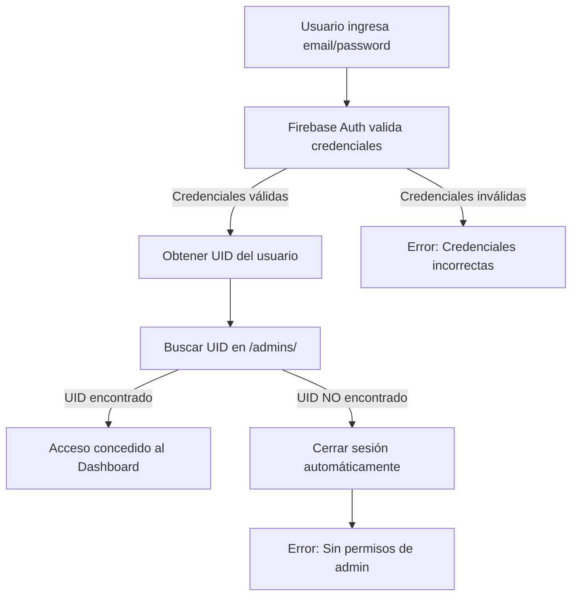

# 🔐 Sistema de Permisos de Administrador

## Cómo Funciona

La aplicación implementa un sistema de doble autenticación:

1. **Firebase Authentication** - Autentica al usuario con email/password
2. **Verificación de Admin** - Verifica que el UID del usuario esté registrado en la colección de admins

## Estructura en Firestore

### Ruta de Admins

**Ruta:** `/crossfitconnect-app/nuevaVersion/admins/`

Cada documento en esta colección representa un administrador autorizado.

### Estructura del Documento

```javascript
{
  "firebaseUID": "abc123xyz456...",  // UID del usuario de Firebase Auth
  "email": "admin@sollte.com",       // Email del admin (opcional)
  "nombre": "Juan Pérez",            // Nombre del admin (opcional)
  "rol": "admin",                    // Rol (opcional)
  "fechaCreacion": Timestamp         // Fecha de creación (opcional)
}
```

### Campo Requerido

| Campo | Tipo | Descripción |
|-------|------|-------------|
| `firebaseUID` | String | UID del usuario en Firebase Authentication (REQUERIDO) |

## Flujo de Autenticación



## Cómo Agregar un Administrador

### Opción 1: Firebase Console (Recomendado)

1. **Crear usuario en Authentication:**
   - Ve a Firebase Console → Authentication
   - Crea un nuevo usuario con email/password
   - **Copia el UID del usuario** (aparece en la lista de usuarios)

2. **Agregar a la colección de admins:**
   - Ve a Firestore Database
   - Navega a: `crossfitconnect-app` → `nuevaVersion` → `admins`
   - Haz clic en "Add document"
   - Agrega el campo:
     ```
     firebaseUID: "el-uid-que-copiaste"
     ```
   - Opcionalmente agrega más campos (email, nombre, etc.)

### Opción 2: Script de Administración

Puedes crear un script para agregar admins programáticamente:

```javascript
import { collection, addDoc } from 'firebase/firestore';
import { db } from './firebase';

async function addAdmin(uid, email, nombre) {
  const adminRef = collection(db, 'crossfitconnect-app', 'nuevaVersion', 'admins');
  await addDoc(adminRef, {
    firebaseUID: uid,
    email: email,
    nombre: nombre,
    rol: 'admin',
    fechaCreacion: new Date()
  });
}
```

## Ejemplo Completo

### 1. Usuario en Firebase Authentication

```
UID: K2fT9GSH4JwdKK6rFF4qY
Email: admin@sollte.com
```

### 2. Documento en /admins/

```javascript
{
  "firebaseUID": "K2fT9GSH4JwdKK6rFF4qY",
  "email": "admin@sollte.com",
  "nombre": "Administrador Principal",
  "rol": "admin",
  "fechaCreacion": "2026-03-09T12:00:00.000Z"
}
```

## Reglas de Seguridad de Firestore

Actualiza las reglas para proteger la colección de admins:

```javascript
rules_version = '2';
service cloud.firestore {
  match /databases/{database}/documents {
    // Función helper para verificar si es admin
    function isAdmin() {
      return exists(/databases/$(database)/documents/crossfitconnect-app/nuevaVersion/admins/$(request.auth.uid));
    }
    
    // WODs - Solo lectura para admins autenticados
    match /crossfitconnect-app/nuevaVersion/wods/{wodId} {
      allow read: if request.auth != null && isAdmin();
      allow write: if false; // Solo desde Firebase Console
    }
    
    // Admins - Solo lectura para verificación
    match /crossfitconnect-app/nuevaVersion/admins/{adminId} {
      allow read: if request.auth != null;
      allow write: if false; // Solo desde Firebase Console
    }
  }
}
```

## Mensajes de Error

La aplicación muestra diferentes mensajes según el tipo de error:

| Error | Mensaje |
|-------|---------|
| Credenciales incorrectas | "Credenciales inválidas. Verifica tu correo y contraseña." |
| Usuario no es admin | "Acceso denegado. Tu cuenta no tiene permisos de administrador." |
| Usuario no encontrado | "Usuario no encontrado" |
| Demasiados intentos | "Demasiados intentos. Intenta más tarde." |

## Verificación en Tiempo Real

El dashboard también verifica los permisos de admin:

- Al cargar la página
- Si el usuario no es admin, se cierra la sesión automáticamente
- Se redirige al login con un mensaje de error

## Solución de Problemas

### "Acceso denegado" después de login exitoso

**Causa:** El UID del usuario no está en la colección `/admins/`

**Solución:**
1. Ve a Firebase Authentication
2. Copia el UID del usuario
3. Ve a Firestore → `/crossfitconnect-app/nuevaVersion/admins/`
4. Crea un documento con el campo `firebaseUID` igual al UID copiado

### Usuario puede autenticarse pero no ve WODs

**Causa:** Reglas de seguridad de Firestore no permiten lectura

**Solución:**
1. Verifica que el usuario esté en `/admins/`
2. Actualiza las reglas de seguridad según el ejemplo anterior
3. Publica las reglas en Firebase Console

## Seguridad

✅ **Buenas prácticas implementadas:**
- Doble verificación (Auth + Firestore)
- Cierre de sesión automático si no es admin
- Verificación en cada carga del dashboard
- Mensajes de error claros sin exponer información sensible

⚠️ **Importante:**
- Nunca expongas los UIDs públicamente
- Mantén la colección `/admins/` protegida con reglas de seguridad
- Revisa regularmente quién tiene acceso de admin
- Considera agregar logs de acceso para auditoría
